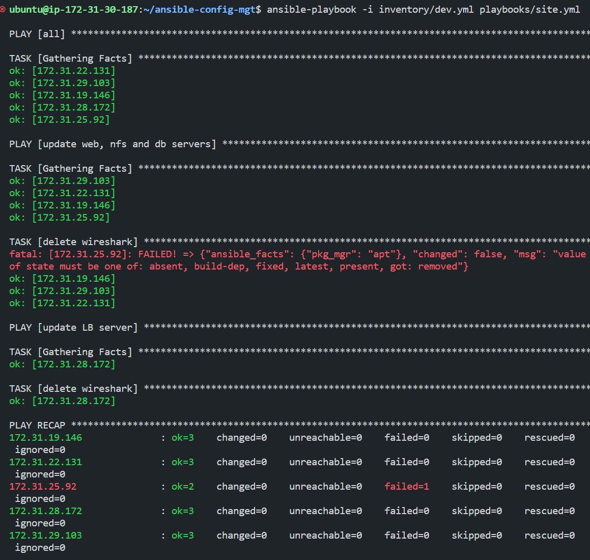
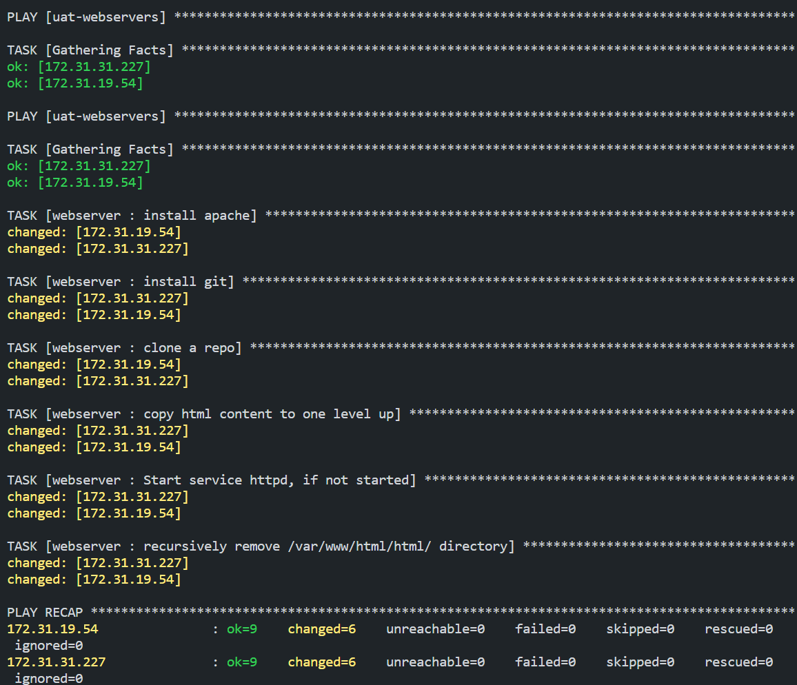

# project 12: ANSIBLE REFACTORING AND STATIC ASSIGNMENTS.


## Table of Contents.
- [Introduction](#introduction)
    - [Code Refactoring](#code-refactoring)
- [Prerequisites](#prerequisites)
- [Jenkins Job Enhancement](#jenkins-job-enhancement)
- [Refactor Ansible Code by Importing Other Playbooks into Site.yml](#refactor-ansible-code-by-importing-other-playbooks-into-siteyml)
- [Configure UAT webservers with a Role 'Webserver'](#configure-uat-webservers-with-a-role-webserver)
- [Reference Webserver Role in Playbook](#reference-webserver-role-in-playbook)
- [Commit and Test](#commit-and-test)
- [Conclusion](#conclusion)


## Introduction
In this project, we would be refactoring the ansible code to make it more modular and reusable than the previous project. We would be learning how to create assignments, and learn how to use the imports functionality.

Imports allow us to effectively re-use previously created playbooks in a new playbook. This is a very powerful feature of Ansible and allows us to create a playbook that is very modular and reusable.


### Code Refactoring
Refactoring is a general term in computer programming. It means making changes to the source code without changing the expected behavior of the software. The main idea of refactoring is to enhance code readability, increase maintainability and extensibility, reduce complexity, and add proper comments without affecting the logic.

In this case, we would move things around a little bit in the code, but the overall state of the infrastructure would remain the same.


## Prerequisites
- Infrastructure: AWS.
- Web Servers: Linux Red Hat.
- Database Server: Ubuntu 20.04 + MySQL.
- Storage Server: Red Hat 8 + NFS.
- Load Balancer: Ubuntu 20.04 (Nginx).
- Jenkins Server.
- Configure Ansible.
- Source Code: Download from <a href="https://github.com/manny-uncharted/ansible-config-mgt.git">here</a>.


## Jenkins Job Enhancement
Before we begin, we need to make some changes to our Jenkins job, at the moment every new change in the codes creates a separate directory which is not very convenient when we want to run some commands from one place. Besides, it consumes space on the Jenkins server. So, we would be making some changes to the Jenkins job to make it more efficient.

- First, go to your Jenkins-Ansible server and create a new directory called 'ansible-config-artifact' we will store all artifacts after each build in the directory.

```
sudo mkdir /home/ubuntu/ansible-config-artifact
```

Results:


- Change permissions to this directory, so that Jenkins can write to it.

```
chmod -R 0777 /home/ubuntu/ansible-config-artifact
```

Results:


- Go to Jenkins web console -> Manage Jenkins -> Manage Plugins -> on Available tab search for Copy Artifact and install this plugin without restarting Jenkins.

Results:


- Create a new Freestyle project and name it 'save-artifact'

- This project will be triggered by the completion of your existing ansible project. Configure it accordingly.
    - In the general section check the box 'Discard old builds' and set the number of builds to keep to 3. This ensures that we only keep the last 3 builds in the directory and prevent it from consuming too much space.

    - In the Build Triggers section, check the box 'Build after other projects are built' and select the project you want to trigger this job after it is completed.

Then click on 'Save'.

Results:


- The main idea of save_artifacts project is to save artifacts into /home/ubuntu/ansible-config-artifact directory. To achieve this, create a Build step and choose Copy artifacts from other projects, specify ansible as a source project and /home/ubuntu/ansible-config-artifact as a target directory.

Results:


- Test your setup by making a change in README.MD file inside your ansible-config-mgt repository (right in the main branch).

If both Jenkins jobs have completed one after another – you shall see your files inside /home/ubuntu/ansible-config-artifact directory and it will be updated with every commit to your master branch.


Results:


Now we've been able to ensure that our Jenkins pipeline is neat and clean.


## Refactor Ansible Code by Importing Other Playbooks into Site.yml

DevOps philosophy implies constant iterative improvement for better efficiency – refactoring is one of the techniques that can be used, but you always have an answer to the question "why?". Why do we need to change something if it works well?

In the previous project, we wrote all tasks in a single playbook common.yml, now it is a pretty simple set of instructions for only 2 types of OS, but imagine you have many more tasks and you need to apply this playbook to other servers with different requirements. In this case, you will have to read through the whole playbook to check if all tasks written there are applicable and if there is anything that you need to add for certain server/OS families. Very fast it will become a tedious exercise and your playbook will become messy with many commented parts. Your DevOps colleagues will not appreciate such organization of your codes and it will be difficult for them to use your playbook.

Most Ansible users learn the one-file approach first. However, breaking tasks up into different files is an excellent way to organize complex sets of tasks and reuse them.


- Before starting to refactor the codes, ensure that you have pulled down the latest code from the master/(main) branch, and created a new branch, name it refactor.

```
git checkout -b refactor
```

Results:


- Within the 'playbooks' directory, create a new file and name it 'site.yml'. This file will now be considered an entry point into the entire infrastructure configuration. Other playbooks will be included here as a reference. In other words, 'site.yml' will become a parent to all other playbooks that will be developed. Including 'common.yml' that you created previously.

Results:


- Create a new folder in the root of the repository and name it 'static-assignments'. The static-assignments folder will contain all other children notebooks. This makes it easy to organize our work. It is not a concept specific to Ansible alone, this allows us to decide how we want to organize our work.

Results:


- Move 'common.yml' file into the newly created 'static-assignments' folder.

Results:


- Inside 'site.yml' file, import common.yml playbook.

```
---
- hosts: all
- import_playbook: ../static-assignments/common.yml
```

Results:


Our folder structure is expected to look like this:

```
├── static-assignments
│   └── common.yml
├── inventory
    └── dev
    └── stage
    └── uat
    └── prod
└── playbooks
    └── site.yml

```

- Run ansible-playbook command against the dev environment.
Since we need to apply some tasks to our dev servers and Wireshark is already installed from the previous project. We would need to create another playbook under the static-assignments and name it 'common-del.yml'. In this playbook, we will remove Wireshark from our dev servers.

```yaml
---
- name: update web, nfs and db servers
  hosts: webservers, nfs, db
  remote_user: ec2-user
  become: yes
  become_user: root
  tasks:
  - name: delete wireshark
    yum:
      name: wireshark
      state: removed

- name: update LB server
  hosts: lb
  remote_user: ubuntu
  become: yes
  become_user: root
  tasks:
  - name: delete wireshark
    apt:
      name: wireshark-qt
      state: absent
      autoremove: yes
      purge: yes
      autoclean: yes
```

Then commit your changes and push them to the remote branch refactor and then create a pull request and merge it to the master/main branch.

Results:


- update site.yml file to include common-del.yml playbook.

```
- import_playbook: ../static-assignments/common-del.yml
```
instead of common.yml and run it against dev servers.

```
ansible-playbook -i inventory/dev playbooks/site.yml
```

Results:



- Ensure that wireshark is removed from all the servers by running the following command.

```
wireshark --version
```

Results:


In this section, we have learned how to use 'import_playbooks' module and we have a ready solution to install/delete packages on multiple servers with just one command.


## Configure UAT webservers with a Role 'Webserver'

We have our nice and clean 'dev' environment, so we want to configure 2 new Web Servers as 'uat (User Acceptance Testing)', UAT is a testing stage that occurs after the development phase and before the production phase. It is a final test to ensure that the software is ready to be deployed to production. In this section, we will create a new role 'webserver' and configure our UAT servers with it.

- Launch 2 new EC2 instances using RHEL 8 image and name them 'uat-web1' and 'uat-web2'.

Results:


- To create a role, you must create a directory called roles/, relative to the playbook file or in /etc/ansible/ directory.
There are two ways how you can create this folder structure:

  - Use an Ansible utility called ansible-galaxy inside the ansible-config-mgt/roles directory (you need to create the roles directory upfront)

```
mkdir roles
cd roles
ansible-galaxy init webserver
```

  - Create the directory/files structure manually
Note: You can choose either way, but since you store all your codes in GitHub, it is recommended to create folders and files there rather than locally on the Jenkins-Ansible server.

The entire folder structure should look like the below, but if you create it manually – you can skip creating tests, files, and vars or remove them if you used ansible-galaxy

```
└── webserver
    ├── README.md
    ├── defaults
    │   └── main.yml
    ├── files
    ├── handlers
    │   └── main.yml
    ├── meta
    │   └── main.yml
    ├── tasks
    │   └── main.yml
    ├── templates
    ├── tests
    │   ├── inventory
    │   └── test.yml
    └── vars
        └── main.yml
```

After removing unnecessary directories and files, the structure of the roles should look like this:

```
└── webserver
    ├── README.md
    ├── defaults
    │   └── main.yml
    ├── handlers
    │   └── main.yml
    ├── meta
    │   └── main.yml
    ├── tasks
    │   └── main.yml
    └── templates
```

Results:


- Update our inventory 'ansible-config-mgt/inventory/uat' file to include our new servers.

```
[uat-webservers]
<Web1-UAT-Server-Private-IP-Address> ansible_ssh_user='ec2-user' 

<Web2-UAT-Server-Private-IP-Address> ansible_ssh_user='ec2-user' 
```

Results:


- In '/etc/ansible/ansible.cfg' file

```
sudo nano /etc/ansible/ansible.cfg
```
then uncomment the 'roles_path' string and update it to the following:

```
roles_path = /home/ubuntu/ansible-config-mgt/roles
```

This is so that Ansible can find the roles directory.

Results:


- At this point, we need to start adding some logic to the webserver role. We would go into the tasks directory, and within the main.yml file, start writing configuration tasks to do the following:
  - Install and configure Apache HTTPD.
  - Clone Tooling website from <a href="https://github.com/manny-uncharted/tooling.git">GitHub</a>.
  - Ensure the tooling website is deployed to /var/www/html on each of 2 UAT web servers.
  - Ensure that the Apache HTTPD service is started.

The 'main.yml' file should look like this:

```yaml
---
- name: install apache
  become: true
  ansible.builtin.yum:
    name: "httpd"
    state: present

- name: install git
  become: true
  ansible.builtin.yum:
    name: "git"
    state: present

- name: clone a repo
  become: true
  ansible.builtin.git:
    repo: https://github.com/manny-uncharted/tooling.git
    dest: /var/www/html
    force: yes

- name: copy html content to one level up
  become: true
  command: cp -r /var/www/html/html/ /var/www/

- name: Start service httpd, if not started
  become: true
  ansible.builtin.service:
    name: httpd
    state: started

- name: recursively remove /var/www/html/html/ directory
  become: true
  ansible.builtin.file:
    path: /var/www/html/html
    state: absent
```

Results:


## Reference Webserver Role in Playbook

Now that we have our webserver role, we can reference it in our playbook. 

- In the 'static-assignments' folder, create a new assignment for 'uat-webservers' group and name it 'uat-webserver.yml'.

This is where we will reference our webserver role.

```
---
- hosts: uat-webservers
  roles:
    - webserver
```

Results:


- Remember to update the entry point to our ansible configuration in 'site.yml' file to include the 'uat-webserver.yml' role.

```
- hosts: uat-webservers
- import_playbook: ../static-assignments/uat-webservers.yml
```

Results:


## Commit and Test

- Commit and push your changes to GitHub.
Create a Pull Request and merge them to master/main branch, make sure the webhook triggered two consequent Jenkins jobs, they ran successfully and copied all the files to your Jenkins-Ansible server into'/home/ubuntu/ansible-config-mgt/' directory.
 
```
git add .
git commit -m "added webserver role"
git push origin main
```

Results:


- SSH into your Jenkins-Ansible server and run the playbook.
<!-- sudo ansible-playbook -i /home/ubuntu/ansible-config-mgt/inventory/uat.yml /home/ubuntu/ansible-config-mgt/playbooks/site.yml -->
```
cd /home/ubuntu/ansible-config-mgt/
ansible-playbook -i inventory/uat.yml playbooks/site.yml
```

Results:



- Open your browser and navigate to the public IP address of your UAT web servers to see the Tooling website.

```
http://<Web1-UAT-Server-Public-IP-or-Public-DNS-Name>/index.php
```

Results:


## Conclusion

We've learned how to deploy and configure UAT web servers using Ansible. We've also learned how to use Ansible roles to organize our configuration tasks.

Our Ansible architecture now looks like this:

