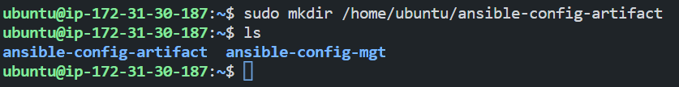
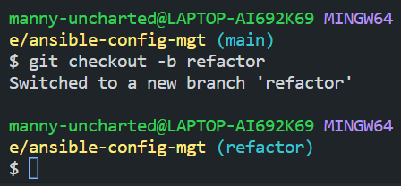

# project 12: ANSIBLE REFACTORING AND STATIC ASSIGNMENTS.


## Table of Contents.
- [Introduction](#introduction)
    - [Code Refactoring](#code-refactoring)
- [Prerequisites](#prerequisites)
- [Jenkins Job Enhancement](#jenkins-job-enhancement)

- [Refactor Ansible Code by Importing Other Playbooks into Site.yml](#refactor-ansible-code-by-importing-other-playbooks-into-siteyml)


## Introduction
In this project, we would be refactoring the ansible code to make it more modular and reusable than the previous project. We would be learning how to create assignments, and learn how to use the imports functionality.

Imports allow us to effectively re-use previously created playbooks in a new playbook. This is a very powerful feature of Ansible and allows us to create a playbook that is very modular and reusable.


### Code Refactoring
Refactoring is a general term in computer programming. It means making changes to the source code without changing the expected behavior of the software. The main idea of refactoring is to enhance code readability, increase maintainability and extensibility, reduce complexity, and add proper comments without affecting the logic.

In this case, we would move things around a little bit in the code, but the overall state of the infrastructure would remain the same.


## Prerequisites
- Infrastructure: AWS.
- Web Servers: Linux Red Hat.
- Database Server: Ubuntu 20.04 + MySQL.
- Storage Server: Red Hat 8 + NFS.
- Load Balancer: Ubuntu 20.04 (Nginx).
- Jenkins Server.
- Configure Ansible.
- Source Code: Download from <a href="https://github.com/manny-uncharted/ansible-config-mgt.git">here</a>.


## Jenkins Job Enhancement
Before we begin, we need to make some changes to our Jenkins job, at the moment every new change in the codes creates a separate directory which is not very convenient when we want to run some commands from one place. Besides, it consumes space on the Jenkins server. So, we would be making some changes to the Jenkins job to make it more efficient.

- First, go to your Jenkins-Ansible server and create a new directory called 'ansible-config-artifact' we will store all artifacts after each build in the directory.

```
sudo mkdir /home/ubuntu/ansible-config-artifact
```

Results:



- Change permissions to this directory, so that Jenkins can write to it.

```
chmod -R 0777 /home/ubuntu/ansible-config-artifact
```

Results:


- Go to Jenkins web console -> Manage Jenkins -> Manage Plugins -> on Available tab search for Copy Artifact and install this plugin without restarting Jenkins.

Results:


- Create a new Freestyle project and name it 'save-artifact'

- This project will be triggered by the completion of your existing ansible project. Configure it accordingly.
    - In the general section check the box 'Discard old builds' and set the number of builds to keep to 3. This ensures that we only keep the last 3 builds in the directory and prevent it from consuming too much space.

    - In the Build Triggers section, check the box 'Build after other projects are built' and select the project you want to trigger this job after it is completed.

Then click on 'Save'.

Results:


- The main idea of save_artifacts project is to save artifacts into /home/ubuntu/ansible-config-artifact directory. To achieve this, create a Build step and choose Copy artifacts from other projects, specify ansible as a source project and /home/ubuntu/ansible-config-artifact as a target directory.

Results:


- Test your setup by making a change in README.MD file inside your ansible-config-mgt repository (right in the main branch).

If both Jenkins jobs have completed one after another – you shall see your files inside /home/ubuntu/ansible-config-artifact directory and it will be updated with every commit to your master branch.


Results:


Now we've been able to ensure that our Jenkins pipeline is neat and clean.


## Refactor Ansible Code by Importing Other Playbooks into Site.yml

DevOps philosophy implies constant iterative improvement for better efficiency – refactoring is one of the techniques that can be used, but you always have an answer to the question "why?". Why do we need to change something if it works well?

In the previous project, we wrote all tasks in a single playbook common.yml, now it is a pretty simple set of instructions for only 2 types of OS, but imagine you have many more tasks and you need to apply this playbook to other servers with different requirements. In this case, you will have to read through the whole playbook to check if all tasks written there are applicable and if there is anything that you need to add for certain server/OS families. Very fast it will become a tedious exercise and your playbook will become messy with many commented parts. Your DevOps colleagues will not appreciate such organization of your codes and it will be difficult for them to use your playbook.

Most Ansible users learn the one-file approach first. However, breaking tasks up into different files is an excellent way to organize complex sets of tasks and reuse them.


- Before starting to refactor the codes, ensure that you have pulled down the latest code from the master/(main) branch, and created a new branch, name it refactor.

```
git checkout -b refactor
```

Results:



- Within the 'playbooks' directory, 